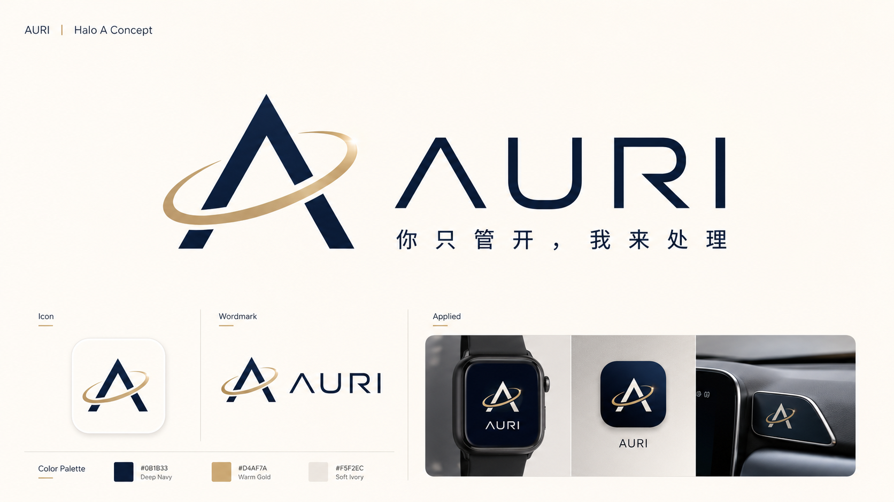

<p align="center">
  
</p>

<h1 align="center">AURI · 随行压力接管 Agent</h1>

<p align="center"><strong>你只管开，我来处理</strong></p>

AURI 是一个面向车机、手机与腕上设备的多端 Agent。它在驾驶通勤中的刚性责任即将失约时，判断介入等级，把交互权交给正确的设备，保护刚性任务，并将剩余生活责任推进到“可确认、可执行、可追踪”的状态。

本仓库用于六周 Demo：**会议延迟 + 晚高峰拥堵 + 接孩子预计迟到 18 分钟**。项目不是普通提醒、导航播报、情绪陪聊或多端页面展示；核心是责任风险模型、唯一主交互端、个性化策略、安全确认与生活服务动作编排。

## 团队同步：当前开发基线

> 最后更新：2026-07-16。[Agent / contracts v0.2 基础 PR #4](https://github.com/954593946/pressure-takeover-agent/pull/4) 已合并。`contracts v0.2` 是当前共享实现基线，仍需各端逐字段评审；发现问题必须通过契约变更 PR 处理，不得在端内复制后自行修改。

| 模块 | 当前可用状态 | 其他成员现在可以做什么 |
|---|---|---|
| Agent / 后端 | FastAPI v0.2 可运行；已有真实 LLM 任务解析、事件、World State、L0-L3、Profile、动作规划、确认幂等、Mock 订单、SSE/WebSocket 和团队令牌鉴权 | 按[接入指南](docs/agent-integration-guide.md)使用标准事件与状态快照开发；共享后端只分发团队令牌，不分发 Bosch API Key |
| 跨端契约 | v0.2 Schema、OpenAPI、示例和 happy-path 事件序列已合并为共享实现基线 | 逐字段评审生产/消费需求；发现缺字段先提契约变更，不在端内补私有字段 |
| 手机端 | 业务 UI 与连接层待开发 | 按 `WorldState` 渲染；通过 Event API 上报任务、Profile 和确认 |
| 车机 / 控制台 | 车机已有早期原型，控制台待接标准事件 | 移除页面自推状态；按 `stage + primary_surface` 渲染和注入事件 |
| 腕上设备 | Active 2 静态框架可运行 | 对齐 `WearableState` 和 `command_id/ACK`，不直接判断压力等级 |

新成员或 AI 编程助手开始工作前，按这个顺序阅读：

1. [AGENTS.md](AGENTS.md)：AI 编程不可违反的仓库规则。
2. [Agent 接入与跨端协作指南](docs/agent-integration-guide.md)：从零理解 Agent、接口、状态流和各端接入方式。
3. 本 README 中的 P0 闭环、模块所有权和视觉规则。
4. 自己模块的 README 与 `contracts/` 实际 Schema/示例。

## AI Agent 开发入口

> 开始任何任务前，先读本节和与你模块对应的正式文档。不得依据现有页面自行推断产品需求，不得在端内发明第二套状态名、压力等级、确认逻辑或视觉 Token。

权威信息按以下顺序使用：

1. [开发功能清单 v1（五人分工版）](随行压力接管Agent_开发功能清单_v1_五人分工版.docx)：**开发执行主依据**，定义 P0/P1/P2、Owner、接口、验收和降级。
2. [六周 Demo 汇报材料 v4（生活服务执行增强版）](随行压力接管Agent_六周Demo汇报材料_v4_生活服务执行增强版.docx)：产品目标、故事线、交互逻辑与真实/模拟边界。
3. 本 README：全仓统一入口、不可违反的跨端规则和 AURI 视觉基线。
4. [Agent 接入与跨端协作指南](docs/agent-integration-guide.md)：面向新手和 AI 的实现说明，不替代产品主依据。
5. `contracts/`：当前可执行接口基线。若正式文档新增了字段，必须先提交契约变更并由生产方、消费方共同评审，再写端侧实现。
6. 现有代码：只代表当前实现进度，不自动成为需求或视觉标准。

旧的 `v2` 汇报材料仅作历史记录，不再作为开发依据。若内容冲突，以“功能清单 v1 → 汇报材料 v4 → README → 已冻结 contracts”的顺序处理，并在 PR 中说明冲突，禁止静默选择。

## 六周 P0 闭环

所有模块必须共同服务同一条故事线：

1. 手机语音创建“18:10 接孩子，之后去超市”。Agent 生成任务图：接孩子是刚性责任，超市是可替代的弹性任务。
2. 控制台注入会议延迟。真实风险算法进入 L1；手机显示风险卡，腕上黄态 + 双短震，车机保持静默。
3. 控制台注入接近/进入车辆。`primary_surface` 在 1 秒内由手机切换为车机；旧手机确认入口失效。
4. 控制台注入 ETA=18:28。Agent 判断预计晚到 18 分钟；用户求助后进入 L2 协调接管。
5. Agent 保护接孩子任务，生成老师/家人消息，并把超市任务匹配为 `grocery_delivery` 能力。
6. Agent 根据 Profile、家庭清单、预算、配送与替代规则生成订单预览。车机只显示“商品数 / 总价 / 配送时段”，手机保存完整明细。
7. 车机仅提供一个“确认处理”入口。消息与预算内低风险订单可以合并确认；超预算、地址变化或替代冲突必须拆分并延后到停车后的手机端。
8. `confirmation_id`、`action_id` 和 `order_id` 全链路幂等；按钮双击与语音并发只能执行一次。
9. 模拟消息发送和下单完成后，三端同步；腕上绿态 + 柔和短震，车机播报一句恢复信息后进入 cooldown。
10. 停车后手机重新成为主端，展示任务、消息、订单、错误和 Action Ledger 复盘。

## 必须实现的核心能力

| 能力 | P0 要求 | 禁止的捷径 |
|---|---|---|
| 责任风险与 L0-L3 | 刚性任务、最晚出发、ETA 偏差、用户求助与辅助信号形成可解释 `reason_codes`；相同输入结果一致 | 让 LLM 自由决定等级；用单次心率、急刹或表情直接判断焦虑 |
| 唯一主交互端 | 车外手机、车内 HMI、腕上始终低干扰辅助；输出带 owner、优先级、过期和去重信息 | 三端同时播报、弹窗或提供确认 |
| 任务与动作编排 | 保护刚性任务，重排弹性任务，生成消息、订单预览和服务动作计划 | 控制台直接切最终 UI；页面脚本冒充状态机 |
| 个性化策略 | 至少支持效率型与品质型订单偏好；交互可支持直接决策、安抚支持、低干扰 Profile | 根据一次行为自动猜人格；个性化改变安全权限 |
| 权限与幂等 | 权限分级、一次性确认、旧入口失效、重复事件/命令/订单去重 | 未确认发送消息、下单或修改敏感信息 |
| 低干扰恢复 | 完成提示只出现一次，随后 cooldown；停车后再展示详情和复盘 | 完成后继续聊天、重复解释或连续震动 |

## 五人模块所有权

| Owner | 主目录 | P0 责任 |
|---|---|---|
| 手机开发 A | `apps/mobile/` | 今日任务、详情、风险、消息、服务方案、Profile、权限、停车后复盘 |
| 手机开发 B | `apps/mobile/` | API Client、WebSocket 状态层、ASR/TTS、缓存重连、调试页、腕上网关与 BLE 协议 |
| 腕上硬件 | `apps/watch/active2-pressure-watch/`、`devices/` | Zepp OS 主路线；状态、触觉、通信、ACK、离线兜底；ESP32-S3 止损路线 |
| 车机 Web | `apps/vehicle-hmi/`、`apps/demo-console/` | 横屏 HMI、唯一确认入口、输出预算、实时同步、场景控制台 |
| Agent / 后端 | `services/agent-api/`、`contracts/`、`packages/test-fixtures/` | World State、事件、状态机、风险、Profile、动作编排、权限幂等、Mock Adapter、日志回放 |

模块边界、接口和个人完成定义见 [docs/workstreams.md](docs/workstreams.md) 与正式功能清单。任何跨模块字段变更必须由一个生产方和一个消费方共同评审。

第一次接 Agent 的成员不要从源码猜接口，直接阅读 [Agent 接入与跨端协作指南](docs/agent-integration-guide.md)，再对照 [OpenAPI](contracts/openapi.yaml)、[Event Schema](contracts/event.schema.json) 和 [World State Schema](contracts/world-state.schema.json)。

## 全局技术契约

- Agent/后端是 World State 的唯一写入者；手机、车机、腕上和控制台只上传事件。
- 必须共享：`Task`、`WorldState`、`Event`、`Action`、`Confirmation`、`Profile`、`WearableState`、`ServiceOrder`。
- 必须支持：事件上报、状态快照、实时状态流、动作确认、Profile 更新和 Session 重置。
- `WorldState` 至少包含 `session_id`、`stage`、`scene`、`primary_surface`、`pressure_level`、`tasks`、`eta`、`actions`、`profile`、`wearable`。
- 驾驶输出预算固定为：**最多 1 句结论 + 1 个动作组 + 1 个确认入口**。非主端只渲染状态，不振动、不播报、不提供可点击确认。
- 所有端依赖后端状态和版本号恢复；刷新或重连后不得出现端侧自推状态漂移。
- 详细架构见 [docs/architecture.md](docs/architecture.md)。当前 `contracts/` 已形成 v0.2 候选基线，包含 Profile、ServiceOrder、交互所有权、L0-L3、Ledger 和生活服务事件；在生产方与消费方共同评审后正式冻结。

## 真实与模拟边界

| 必须真实开发 | 本轮可控模拟 | 本轮不做 |
|---|---|---|
| 三端 UI、腕上真机显示/震动、任务结构化、L0-L3、场景交接、动作编排、权限、确认幂等、状态广播、订单预览与 Ledger | 会议、车辆、路况、ETA、部分心率/驾驶信号、商品/库存/价格/配送、消息发送和下单结果 | 真实车辆/CAN、真实微信短信、电商账号与支付、真实车控、医学诊断、完整导航、开放式陪聊 |

一句话口径：**我们模拟外部世界和第三方服务结果，不模拟产品核心闭环。** 所有金额、联系人、地址、消息和订单状态必须显著标注“模拟”或“Demo 数据”。

## AURI 视觉与交互基线

根目录 [品牌.png](品牌.png) 是当前品牌板和视觉依据。品牌名统一写作 **AURI**，场景口号统一为 **“你只管开，我来处理”**；代码和界面中遗留的 `EMO` 必须在后续模块改动时迁移，不得新增。

### 品牌 Token

| Token | 色值 | 用途 |
|---|---|---|
| `--auri-navy` | `#0B1B33` | 主品牌色、深色背景、标题与高对比文本 |
| `--auri-gold` | `#D4AF7A` | Logo 光环、品牌强调、焦点细节；不可大面积铺底 |
| `--auri-ivory` | `#F5F2EC` | 浅色背景、卡片底和温和留白 |
| `--state-processing` | `#2F6BFF` | 驾驶连接、规划、接管处理中 |
| `--state-warning` | `#E6A700` | L1 时间窗口压缩与待注意状态 |
| `--state-success` | `#2E9D6F` | 已完成、已同步、恢复态 |
| `--state-critical` | `#D1495B` | L3 高负荷保护、错误和必须处理的阻断 |

状态不能只靠颜色表达，必须同时提供文字和图标。品牌金和风险黄含义不同：品牌金只做识别与强调，风险状态必须同时出现时钟/警示图标和明确文案。

### 跨端视觉规则

- **形象**：使用极简 AURI 标识和克制的光晕/轨道语言，不使用拟人 3D 角色、聊天机器人头像或持续抢注意力的动画。
- **Logo**：保持原始比例，不拉伸、不重绘、不改变字标间距。当前 `品牌.png` 是品牌板，不得由 AI 自动裁切成生产图标；在获得透明 SVG/PNG 前，产品界面使用固定尺寸的 AURI 文字标识或 Logo 占位。
- **字体**：界面优先 `Inter, "PingFang SC", "Microsoft YaHei", sans-serif`；标题稳重、正文高可读，不用装饰性字体模拟 Logo。
- **布局**：采用 8px 间距体系、16-24px 圆角和充足留白；同一页面只允许一个主要 CTA。
- **车机**：深海军蓝为主要底色，结论字号建议 32-40px、正文不低于 18px、主要按钮高度不低于 56px；一屏一事，禁止商品长列表、消息全文和多按钮并列。
- **手机**：象牙白为主背景，深蓝标题，金色只做品牌强调；车外展示完整信息，驾驶中进入只读 Companion 状态并指向车机确认。
- **腕上**：单屏最多两行核心文字；状态使用“颜色 + 图标 + 一次触觉”。warning=双短震，handover=一次短震，processing=三拍或单脉冲，completed=柔和短震，error/L3=一次明确组合后静默。
- **动效**：只表达状态连续性；光晕应柔和、低频、可停止。禁止循环闪烁、连续震动和高饱和霓虹渐变。

现有车机和腕上代码是早期原型，颜色、`EMO` 文案和状态名尚未全部符合本节。后续修改这些模块时，以本节和已冻结 contracts 为准，并在同一 PR 中完成必要迁移，禁止继续扩散旧命名。

## 当前实现状态

- `apps/vehicle-hmi/`：已有可交互横屏原型和场景推进脚本，尚需接统一 World State、P0 新状态和 AURI 视觉。
- `apps/watch/active2-pressure-watch/`：已有 Active 2 466×466 静态框架与状态映射，Side Service、真实震动、ACK 和新触觉编码仍待实现。
- `apps/mobile/`：目前仅有模块说明，业务 UI 与连接层待开发。
- `apps/demo-console/`：目前仅有模块说明，场景事件、服务异常和重置控制台待开发。
- `services/agent-api/`：已有 FastAPI v0.2 基础版，包含事件幂等、World State、L0-L3、主交互端、Profile、动作规划、确认幂等、Mock Adapter、Ledger、SSE/WebSocket 和 OpenAI 兼容适配器；当前使用进程内存存储，适合单实例 Demo。
- `contracts/`：已有 v0.2 候选 Schema、OpenAPI、正向样例和标准事件序列，等待跨端共同评审后冻结。

## AI Agent 开工与完成检查

开始编码前：

1. 同步最新分支并确认没有覆盖他人改动。
2. 阅读本 README、功能清单和本模块 README；明确 Owner、P0 输入、输出、失败降级。
3. 检查 `contracts/` 是否已支持所需字段；不支持时先改契约、示例和测试夹具。
4. 优先使用固定 World State 和标准事件序列独立开发，不把 Demo 流程硬编码在页面点击顺序中。
5. 只修改当前任务所需目录；跨端改动在 PR 中点名生产方与消费方。

完成一个功能前必须确认：

- 能由真实状态进入，不是静态跳转或控制台直接改 UI。
- 刷新、重连、重复事件和重复确认不会制造第二份状态或动作。
- 驾驶态遵守唯一主交互端和输出预算。
- UI 使用 AURI 名称、品牌 Token 和正确状态语义。
- 有最小测试方法、失败兜底和可复现启动说明。
- 不提交 API Key、真实联系人、真实地址、支付信息或设备凭据。

## 仓库结构

```text
apps/
  mobile/                         手机端业务 UI 与连接/腕上网关
  vehicle-hmi/                    车机横屏 HMI（已有原型）
  demo-console/                   场景与故障控制台
  watch/active2-pressure-watch/   Amazfit Active 2 工程（已有框架）
services/agent-api/               Agent 后端、状态机和服务适配器
devices/                          Zepp OS 说明与 ESP32-S3 兜底路线
contracts/                        跨端 Schema、OpenAPI 和示例
packages/ui/                      跨 Web 端共享视觉 Token/组件
packages/test-fixtures/           标准场景、快照和异常回归数据
docs/                             架构、范围、分工与 ADR
```

## 协作方式

- `main` 必须保持可演示；使用短分支和 Pull Request，禁止直接覆盖他人模块。
- 分支示例：`feat/mobile-profile`、`feat/agent-service-order`、`fix/watch-command-idempotency`。
- Commit 示例：`feat(agent): add order preview`、`fix(hmi): suppress duplicate confirmation`。
- 契约变更必须同时更新 Schema、示例和受影响模块说明。
- 详细规则见 [CONTRIBUTING.md](CONTRIBUTING.md)。

## 当前必须优先冻结

1. contracts v0.2 跨端评审：确认八个共享对象、事件名、状态名、错误码和示例，并冻结候选基线。
2. 手机与后端技术栈、统一 API Client 和状态层边界。
3. Zepp OS Side Service / BLE 网关链路与 ACK 协议；保留 ESP32-S3 止损点。
4. HMI 目标屏幕参数，以及可直接用于产品界面的透明 AURI Logo/Icon 素材。
5. ASR、TTS、LLM 服务和离线兜底方案。

冻结之前可以使用 Mock 和占位，但不得在各模块中形成互不兼容的私有协议。
